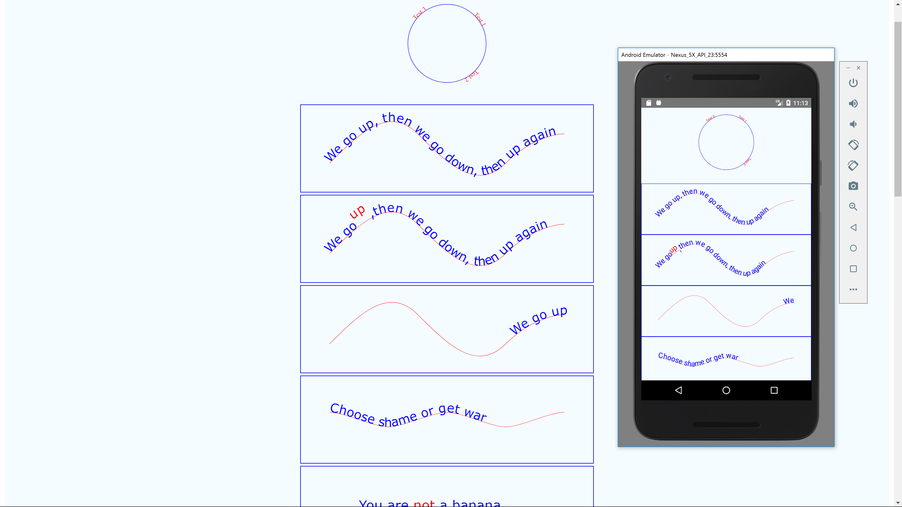
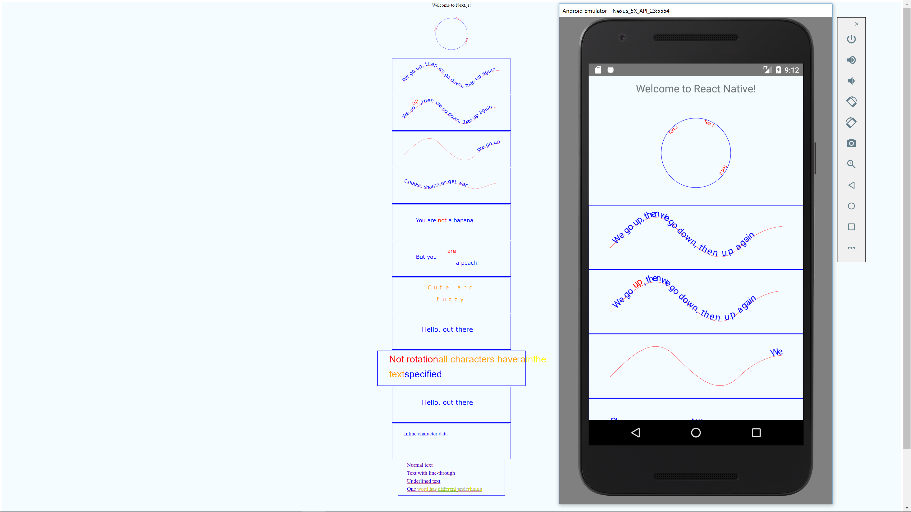

# Minimal reproduction of text path rendering bug in react-native-svg

Renders correctly in web / next.js, the text is on top of the path referenced in textpath

Renders incorrectly in native, text is below path (at least android, haven't tried ios)

To test android

`react-native run-android`

To test web / next.js

`npm run dev`

